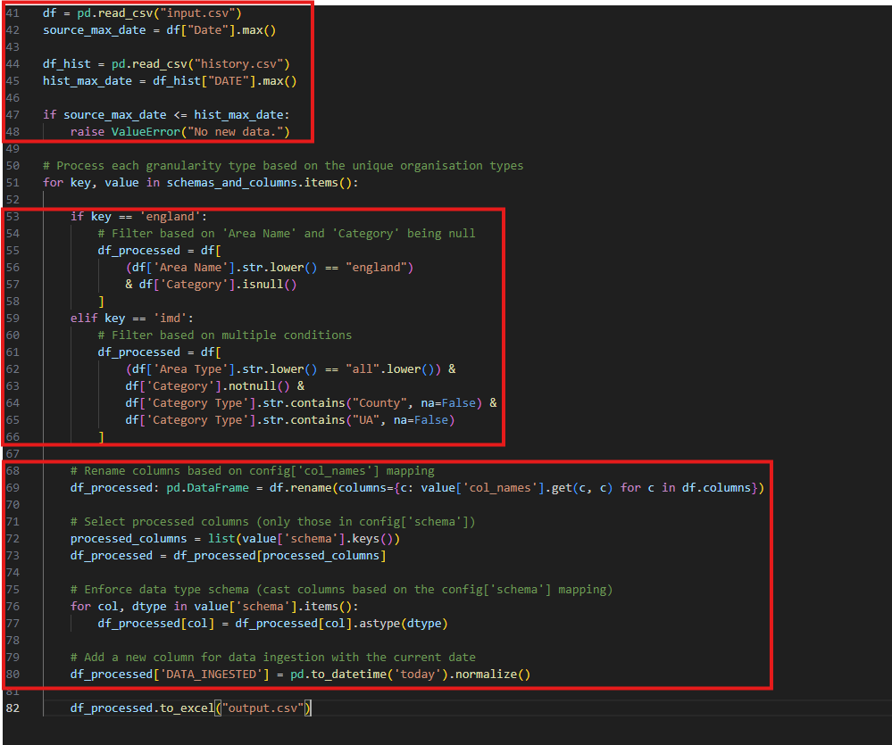

# Example

## 101

A class is a blueprint for creating objects. Objects are instances of classes and can represent real-world things like students, cars, bank accounts, etc.

```python
class Dog:
    def __init__(self, name):
        self.name = name

    def bark(self):
        print(f"{self.name} says woof!")

my_dog = Dog("Rex")
my_dog.bark()  # Output: Rex says woof!
```

- class Dog: → Defines the class.

- __init__() → A special method called constructor that runs when an object is created.

- self → Refers to the current instance of the class.

- self.name = name → Stores the dog's name.

- bark() → A method (like a function) defined for the class.

## Benefits

- Group related data and behavior together.

- Make code reusable and organized.

- Enable abstraction and encapsulation.

- Lay the foundation for object-oriented programming (OOP).


## Quick Tips

- Use __init__ to initialize attributes.

- Use self to refer to instance-specific data.

- Use super() to access parent class methods when using inheritance.

- Class names use PascalCase by convention (e.g., Student, SchoolClass).

# Exercise

Data Engineering Exercise

The image below displays code that can be refactored. Steps:
1. Read in source and target data
2. Check if there is new data
3. Filter source data
4. Rename source and cast to correct data types
5. Add date when data was ingested

Can we group them such that we have logic that is universal to all datasets?
Can we group what is bespoke to this dataset?

Based on the questions rewrite using classes and decarators.

